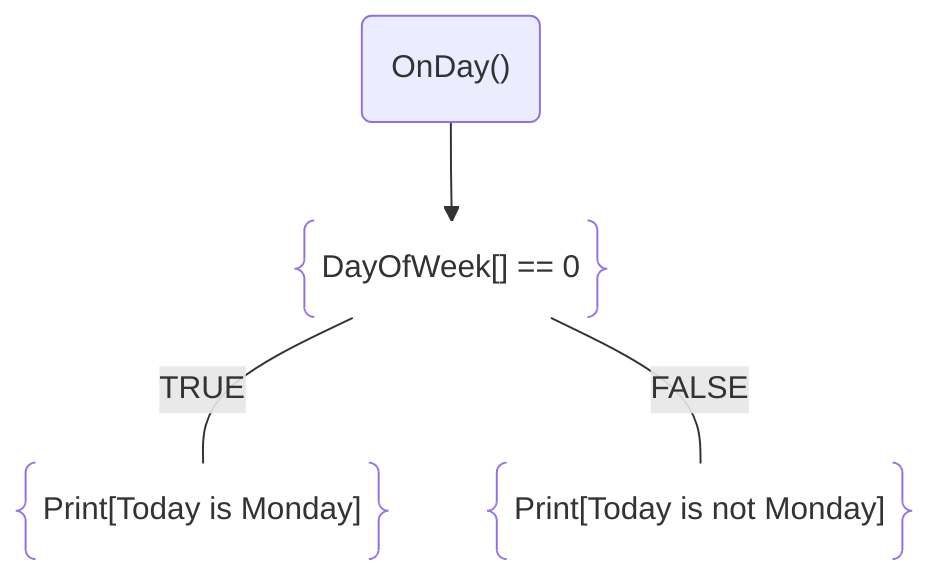

import ImgFrame from "@components/ImgFrame.astro";
import { Aside } from "@astrojs/starlight/components";
import Preview from "@components/Preview.astro";
import { Steps } from "@astrojs/starlight/components";

Nesta página, você encontrará informações sobre os eventos, para que servem e como eles podem ser utilizados em estratégias no ScriptBot.

{/* prettier-ignore */}
<Aside>
Os eventos ainda não estão em sua versão final. Em futuras atualizações, será incluída uma manipulação mais avançada e flexível dos eventos.

Algumas funcionalidades previstas incluem:

- **Manipulação de fluxo:** Permitir cancelar a execução e continuação de uma ação específica;
- **Manipulação de dados:** Permitir alteração dos parâmetros de um evento;

Atualmente, os eventos são utilizados de forma simples para monitorar e reagir a acontecimentos do mercado, sem interferir no fluxo principal de execução do robô.

</Aside>

## O que é um evento?

Eventos são ações ou ocorrências que acontecem durante a execução do robô, como a abertura de uma ordem, o encerramento de uma posição ou a validação de um gatilho. Sempre que uma tarefa relevante é realizada, o robô dispara um evento correspondente.

Esses eventos podem ser monitorados e utilizados para automatizar as ações do robô em diferentes situações de mercado. Dessa forma, o usuário pode configurar regras e estratégias personalizadas que respondem imediatamente após uma ação ocorrer, sem depender de temporizadores ou atrasos adicionais.

Na prática, os eventos tornam o ScriptBot mais inteligente, dinâmico e flexível, permitindo a execução de ações em tempo real a partir de cada ocorrência. Isso proporciona maior controle e aumenta a eficiência das estratégias.

## Configurando os eventos

A configuração dos eventos é simples e intuitiva. Abaixo, você pode visualizar uma imagem que ilustra a estrutura dos eventos:

<ImgFrame></ImgFrame>

Cada evento pode ser configurado de forma personalizada, de acordo com as necessidades do usuário.

### Evento

- **[01] - Tipo**: Define o tipo do evento que será ouvido. Acesse a [Lista de Eventos](/fundamentals/events/)
- **[02 & 03] - Cálculos de Validação**: São expressões condicionais que o sistema executa quando o evento for chamado.
- **[04] - Executar em caso de sucesso**: Ações que serão executadas quando o evento for validado.
- **[05] - Executar em caso de falha**: Ações que serão executadas quando o evento falhar.

## Exemplo

Neste exemplo, vamos monitorar o evento de início de um novo dia e registrar uma mensagem nas logs indicando se é segunda-feira ou não.

Exemplo da configuração:

<ImgFrame></ImgFrame>

Sempre que um novo dia começar, o evento `OnDay()` será acionado. O sistema então realizará os cálculos necessários para determinar se o evento foi validado ou não.

O fluxo da execução segue a seguinte ordem:

<Preview>

</Preview>

O fluxo é resumido nas seguintes etapas:

{/* prettier-ignore */}
<Steps>
1. **EVENTO**
   * Evento: `OnDay()`.
   * Evento que será monitorado.
2. **CÁLCULOS**
   * Condição: `DayOfWeek[] == 0`.
   * Responsável por executar a tentativa da validação.
   * Se o resultado for **verdadeiro**, o fluxo segue para a etapa **(SUCESSO)**.
   * Se o resultado for **falso**, o fluxo segue para a etapa **(FALHA)**.
3. **SUCESSO**
   * Resposta: `Print["Today is Monday"]`.
   * Executa os cálculos definidos para o cenário de validação bem-sucedida.
4. **FALHA**
   * Resposta: `Print["Today is not Monday"]`.
   * Executa os cálculos definidos para o cenário de validação mal-sucedida.
</Steps>
