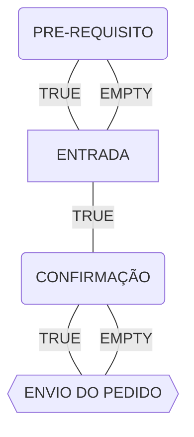
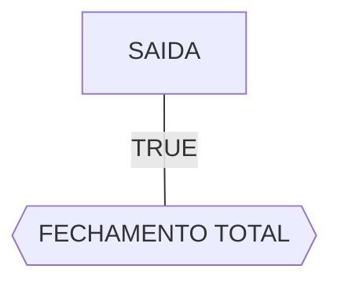
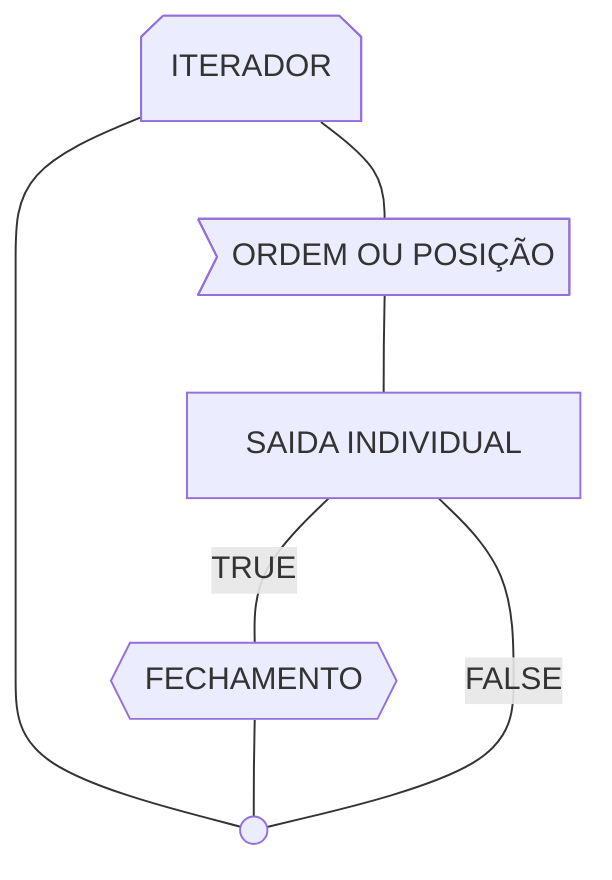
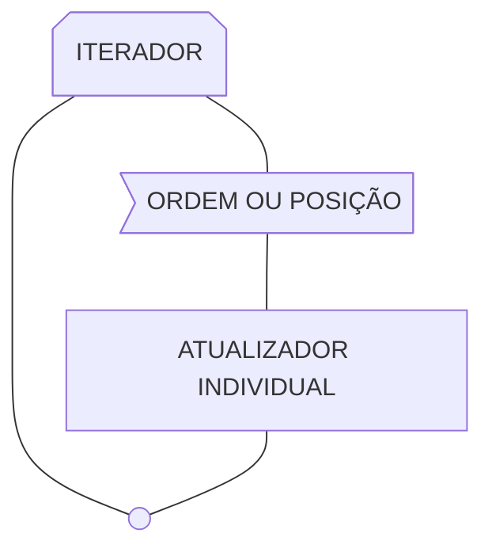

import ImgFrame from "@components/ImgFrame.astro";
import Preview from "@components/Preview.astro";
import { Aside } from "@astrojs/starlight/components";
import { Steps } from "@astrojs/starlight/components";

Nesta página, você encontrará informações sobre os gatilhos de entrada, saída e atualização disponíveis no ScriptBot.

## O que é um gatilho?

Um gatilho funciona como um ponto de execução, responsável por verificar uma condição definida pelo usuário. Essa condição é expressa por meio de expressões lógicas e avaliada periodicamente, de acordo com a [frequência configurada](/settings/frequencies).

No ScriptBot, os gatilhos representam a forma como o robô manipula posições e ordens no mercado, atuando de maneira automatizada conforme as regras definidas pelo usuário.

**Por exemplo:**

- **Gatilhos de entrada:** executam uma lógica que, quando validada, acionam a entrada no mercado, realizando uma compra ou venda.
- **Gatilhos de saída:** executam uma lógica que, quando confirmada, determinam a saída do mercado, seja fechando uma posição ou cancelando um pedido.
- **Gatilhos de atualização:** executam uma lógica para modificar ordens ou posições já existentes, ajustando-as conforme necessário.

Existem vários tipos de gatilhos, e cada um possui uma função específica dentro do fluxo de operações, permitindo maior controle e flexibilidade na automação das estratégias.

## Gatilhos de entrada

Os gatilhos de entrada são responsáveis por realizar cálculos e avaliar condições para determinar se uma ordem de compra ou venda deve ser executada. Esses gatilhos possuem um fluxo de execução, o que os torna mais flexíveis na criação das estratégias.

Abaixo está uma imagem contendo os gatilhos de entrada disponíveis no ScriptBot.

<ImgFrame></ImgFrame>

Os gatilhos seguem uma ordem de execução baseada em uma lógica condicional que define o fluxo da estratégia. Alguns são obrigatórios, enquanto outros são opcionais, mas todos, quando combinados, compõem o funcionamento completo da estratégia.

O fluxo de operações do ScriptBot segue a seguinte ordem:

<Preview>

</Preview>

O fluxo de execução é composto por quatro etapas principais, organizadas sequencialmente:

{/* prettier-ignore */}
<Steps>
1. **PRE-REQUISITO**  
   - Primeira verificação da sequência.  
   - Responsável por fazer verificações iniciais, usadas para cálculos simples e rápidos.  
   - Se validado como **verdadeiro**, o fluxo prossegue para o próximo gatilho.  
   - **Opcional**: caso esteja vazio, o processo segue diretamente para o **ENTRADA**.
2. **ENTRADA**  
   - Gatilho de entrada da estratégia.  
   - Responsável por realizar o cálculo da lógica principal da estratégia.  
   - Se validado como **verdadeiro**, leva à próxima etapa (**CONFIRMAÇÃO**).
3. **CONFIRMAÇÃO**  
   - Confirmação adicional antes da execução.  
   - Responsável por fazer cálculos adicionais, se necessário.  
   - **Opcional**: se não estiver configurado, o fluxo segue diretamente para **ENVIO DO PEDIDO**.
4. **ENVIO DO PEDIDO**  
   - Etapa final do fluxo.  
   - Responsável pelo envio da operação propriamente dita.
</Steps>

 

{/* prettier-ignore */}
<Aside type="tip">
  Confira a página de [Configurações de Operações](/settings/operations) para complementar seu entendimento sobre os gatilhos e dar os primeiros passos na criação da sua estratégia.
</Aside>

## Gatilhos de saída

Os gatilhos de saida são responsáveis por realizar cálculos e avaliar condições para determinar se uma ordem de compra ou venda deve ser removida.

Abaixo está uma imagem contendo os gatilhos de saída disponíveis no ScriptBot.

<ImgFrame></ImgFrame>

No ScriptBot, existem quatro tipos diferentes de gatilhos de saída, cada um responsável por um tipo específico de finalização.

### Gatilhos de saída totais

Os gatilhos de **saída total** são responsáveis por tentar encerrar todas as **posições** e **ordens** atualmente abertas, de acordo com as condições definidas pelo usuário.

<ImgFrame></ImgFrame>

O fluxo de saída segue a seguinte ordem:

<Preview>

</Preview>

O fluxo é resumido em duas etapas:

{/* prettier-ignore */}
<Steps>
1. **SAÍDA**  
   - Representa o cálculo principal para realizar o fechamento.  
   - Tem como função verificar se é possível encerrar todas as posições ou ordens em aberto.  
   - Se o resultado for **verdadeiro**, o processo avança para a etapa seguinte: **FECHAMENTO TOTAL**.  
   - **Importante**: se este campo estiver vazio, nenhum cálculo de fechamento será executado.
2. **FECHAMENTO TOTAL**  
   - Última etapa do fluxo.  
   - Responsável por encerrar definitivamente todas as posições e ordens abertas.
</Steps>

### Gatilhos de saída individuais

Os gatilhos de **saída individual** são responsáveis por tentar encerrar, de forma isolada, as **posições** e **ordens** atualmente abertas.

Esse tipo de cálculo realiza uma **iteração separada** para cada posição ou ordem, permitindo que o usuário defina **condições específicas** para o fechamento de cada uma delas.

<ImgFrame></ImgFrame>

O fluxo de saída segue a seguinte ordem:

<Preview>

</Preview>

O fluxo é resumido nas seguintes etapas:

{/* prettier-ignore */}
<Steps>
1. **ITERADOR**  
   - Inicia o ciclo do fluxo.  
   - Controla a repetição sobre uma coleção de ordens ou posições.  
   - Garante que cada item seja processado individualmente, mantendo o controle do avanço.
2. **SELEÇÃO DA ORDEM OU POSIÇÃO**  
   - Etapa responsável por selecionar a próxima ordem ou posição a ser processada.  
   - Responsável por alimentar as [Variáveis Locais,](/placeholders/variables/#positions-and-orders).  
   - Essa seleção alimenta a etapa seguinte: **SAÍDA INDIVIDUAL**.
3. **SAÍDA INDIVIDUAL**  
   - Realiza a verificação principal para determinar se a ordem ou posição pode ser encerrada.  
   - Se o resultado for **verdadeiro**, o fluxo segue para a etapa de **FECHAMENTO**.  
   - Se **falso**, o item não será encerrado e o fluxo retorna diretamente ao **ITERADOR** para processar o próximo.
4. **FECHAMENTO**  
   - Etapa final do processamento individual.  
   - Encerra a ordem ou posição que foi validada na etapa anterior.  
   - Após o fechamento, o fluxo retorna ao **ITERADOR** para continuar o ciclo com o próximo item.
</Steps>

### Gatilhos de atualização individuais

Os gatilhos de **atualização individual** são responsáveis por selecionar, de forma isolada, um **pedido**, bem como as **posições** e **ordens** que estão abertas no momento.

Esse tipo de cálculo realiza uma **iteração separada** para cada posição ou ordem, permitindo que o usuário manipule este pedido, modificando seus dados, como stop, take e preços.

<ImgFrame></ImgFrame>

O fluxo de atualização segue a seguinte ordem:

<Preview>

</Preview>

O fluxo é resumido nas seguintes etapas:

{/* prettier-ignore */}
<Steps>
1. **ITERADOR**  
   - Inicia o ciclo do fluxo.  
   - Controla a repetição sobre uma coleção de ordens ou posições.  
   - Garante que cada item seja processado individualmente, mantendo o controle do avanço.
2. **SELEÇÃO DA ORDEM OU POSIÇÃO**  
   - Etapa responsável por selecionar a próxima ordem ou posição a ser processada.  
   - Responsável por alimentar as [Variáveis Locais,](/placeholders/variables/#positions-and-orders).  
   - Essa seleção alimenta a etapa seguinte: **ATUALIZADOR INDIVIDUAL**.
3. **ATUALIZADOR INDIVIDUAL**  
   - Realiza os cálculos condicionais da ordem ou posição.  
   - Após a manipulação, o fluxo retorna ao **ITERADOR** para continuar o ciclo com o próximo item.
</Steps>
