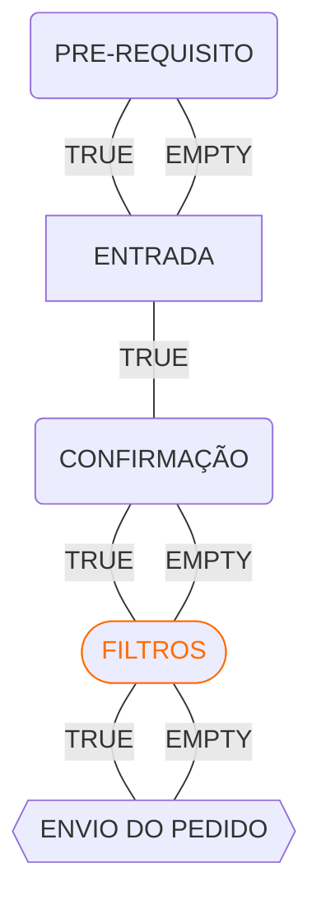

import ImgFrame from "@components/ImgFrame.astro";
import Preview from "@components/Preview.astro";
import { Aside } from "@astrojs/starlight/components";
import { Steps } from "@astrojs/starlight/components";

Nesta página, você encontrará informações sobre os gatilhos de entrada, saída e atualização disponíveis no ScriptBot.

## O que é um gatilho?

Um gatilho é um ponto de execução automatizado que verifica, em intervalos regulares, uma condição lógica definida pelo usuário. Essas condições são expressas por meio de expressões lógicas e avaliadas conforme a [frequência configurada](/settings/frequencies).

No ScriptBot, os gatilhos são o mecanismo central de controle sobre ordens e posições, permitindo que o robô atue de forma autônoma, seguindo as regras definidas pelo usuário. Os principais tipos de gatilhos são:

- **Gatilhos de entrada:** disparam ordens de compra ou venda quando a condição de entrada for satisfeita;
- **Gatilhos de saída:** executam a saída do mercado, encerrando uma posição ou cancelando uma ordem;
- **Gatilhos de atualização:** ajustam ordens ou posições existentes, com base em condições atualizadas do mercado.

Há diferentes tipos de gatilhos, cada um com um papel específico no fluxo da estratégia. Eles oferecem controle granular e flexibilidade para automatizar decisões com precisão e segurança.

## Gatilhos de entrada

Os gatilhos de entrada são responsáveis por realizar cálculos e avaliar condições para determinar se uma ordem de compra ou venda deve ser executada. Esses gatilhos possuem um fluxo de execução, o que os torna mais flexíveis na criação das estratégias.

Abaixo está uma imagem contendo os gatilhos de entrada disponíveis no ScriptBot.

<ImgFrame></ImgFrame>

Os gatilhos seguem uma ordem de execução baseada em uma lógica condicional que define o fluxo da estratégia. Alguns são obrigatórios, enquanto outros são opcionais, mas todos, quando combinados, compõem o funcionamento completo da estratégia.

O fluxo de operações do ScriptBot segue a seguinte ordem:

<Preview>

</Preview>

O fluxo de execução é composto por quatro etapas principais, organizadas sequencialmente:

{/* prettier-ignore */}
<Steps>
1. **PRE-REQUISITO**
   - Primeira verificação da sequência.
   - Responsável por fazer verificações iniciais, usadas para cálculos simples e rápidos.
   - Se validado como **verdadeiro**, o fluxo prossegue para o próximo gatilho.
   - **Opcional**: caso esteja vazio, o processo segue diretamente para o **ENTRADA**.
2. **ENTRADA**
   - Gatilho de entrada da estratégia.
   - Responsável por realizar o cálculo da lógica principal da estratégia.
   - Se validado como **verdadeiro**, leva à próxima etapa (**CONFIRMAÇÃO**).
3. **CONFIRMAÇÃO**
   - Confirmação adicional antes da execução.
   - Responsável por fazer cálculos adicionais, se necessário.
   - **Opcional**: se não estiver configurado, o fluxo segue diretamente para **FILTROS**.
4. **FILTROS**
   - Os filtros aplicam múltiplas camadas de validações para aumentar a **confiabilidade** da estratégia.
   - Cada filtro realiza uma **validação específica** e pode ter **pesos diferentes**, permitindo uma análise mais refinada.
   - A documentação completa sobre os filtros podem ser encontradas em [Filtros](/conditions/filters).
   - **Opcional**: se não estiver configurado, o fluxo segue diretamente para **ENVIO DO PEDIDO**.
5. **ENVIO DO PEDIDO**
   - Etapa final do fluxo.
   - Responsável pelo envio da operação propriamente dita.
</Steps>

 

{/* prettier-ignore */}
<Aside type="tip">
  Confira a página de [Configurações de Operações](/settings/operations) para complementar seu entendimento sobre os gatilhos e dar os primeiros passos na criação da sua estratégia.
</Aside>

## Gatilhos de saída

Os gatilhos de saida são responsáveis por realizar cálculos e avaliar condições para determinar se uma ordem de compra ou venda deve ser removida.

Abaixo está uma imagem contendo os gatilhos de saída disponíveis no ScriptBot.

<ImgFrame></ImgFrame>

No ScriptBot, existem quatro tipos diferentes de gatilhos de saída, cada um responsável por um tipo específico de finalização.

### Gatilhos de saída totais

Os gatilhos de **saída total** são responsáveis por tentar encerrar todas as **posições** e **ordens** atualmente abertas, de acordo com as condições definidas pelo usuário.

<ImgFrame></ImgFrame>

O fluxo de saída segue a seguinte ordem:

<Preview>

</Preview>

O fluxo é resumido em duas etapas:

{/* prettier-ignore */}
<Steps>
1. **SAÍDA**  
   - Representa o cálculo principal para realizar o fechamento.  
   - Tem como função verificar se é possível encerrar todas as posições ou ordens em aberto.  
   - Se o resultado for **verdadeiro**, o processo avança para a etapa seguinte: **FECHAMENTO TOTAL**.  
   - **Importante**: se este campo estiver vazio, nenhum cálculo de fechamento será executado.
2. **FECHAMENTO TOTAL**  
   - Última etapa do fluxo.  
   - Responsável por encerrar definitivamente todas as posições e ordens abertas.
</Steps>

### Gatilhos de saída individuais

Os gatilhos de **saída individual** são responsáveis por tentar encerrar, de forma isolada, as **posições** e **ordens** atualmente abertas.

Esse tipo de cálculo realiza uma **iteração separada** para cada posição ou ordem, permitindo que o usuário defina **condições específicas** para o fechamento de cada uma delas.

<ImgFrame></ImgFrame>

O fluxo de saída segue a seguinte ordem:

<Preview>

</Preview>

O fluxo é resumido nas seguintes etapas:

{/* prettier-ignore */}
<Steps>
1. **ITERADOR**  
   - Inicia o ciclo do fluxo.  
   - Controla a repetição sobre uma coleção de ordens ou posições.  
   - Garante que cada item seja processado individualmente, mantendo o controle do avanço.
2. **SELEÇÃO DA ORDEM OU POSIÇÃO**  
   - Etapa responsável por selecionar a próxima ordem ou posição a ser processada.  
   - Responsável por alimentar as [Variáveis Locais,](/placeholders/variables/#positions-and-orders).  
   - Essa seleção alimenta a etapa seguinte: **SAÍDA INDIVIDUAL**.
3. **SAÍDA INDIVIDUAL**  
   - Realiza a verificação principal para determinar se a ordem ou posição pode ser encerrada.  
   - Se o resultado for **verdadeiro**, o fluxo segue para a etapa de **FECHAMENTO**.  
   - Se **falso**, o item não será encerrado e o fluxo retorna diretamente ao **ITERADOR** para processar o próximo.
4. **FECHAMENTO**  
   - Etapa final do processamento individual.  
   - Encerra a ordem ou posição que foi validada na etapa anterior.  
   - Após o fechamento, o fluxo retorna ao **ITERADOR** para continuar o ciclo com o próximo item.
</Steps>

### Gatilhos de atualização individuais

Os gatilhos de **atualização individual** são responsáveis por selecionar, de forma isolada, um **pedido**, bem como as **posições** e **ordens** que estão abertas no momento.

Esse tipo de cálculo realiza uma **iteração separada** para cada posição ou ordem, permitindo que o usuário manipule este pedido, modificando seus dados, como stop, take e preços.

<ImgFrame></ImgFrame>

O fluxo de atualização segue a seguinte ordem:

<Preview>

</Preview>

O fluxo é resumido nas seguintes etapas:

{/* prettier-ignore */}
<Steps>
1. **ITERADOR**  
   - Inicia o ciclo do fluxo.  
   - Controla a repetição sobre uma coleção de ordens ou posições.  
   - Garante que cada item seja processado individualmente, mantendo o controle do avanço.
2. **SELEÇÃO DA ORDEM OU POSIÇÃO**  
   - Etapa responsável por selecionar a próxima ordem ou posição a ser processada.  
   - Responsável por alimentar as [Variáveis Locais,](/placeholders/variables/#positions-and-orders).  
   - Essa seleção alimenta a etapa seguinte: **ATUALIZADOR INDIVIDUAL**.
3. **ATUALIZADOR INDIVIDUAL**  
   - Realiza os cálculos condicionais da ordem ou posição.  
   - Após a manipulação, o fluxo retorna ao **ITERADOR** para continuar o ciclo com o próximo item.
</Steps>
